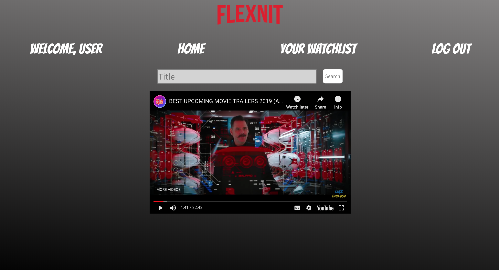
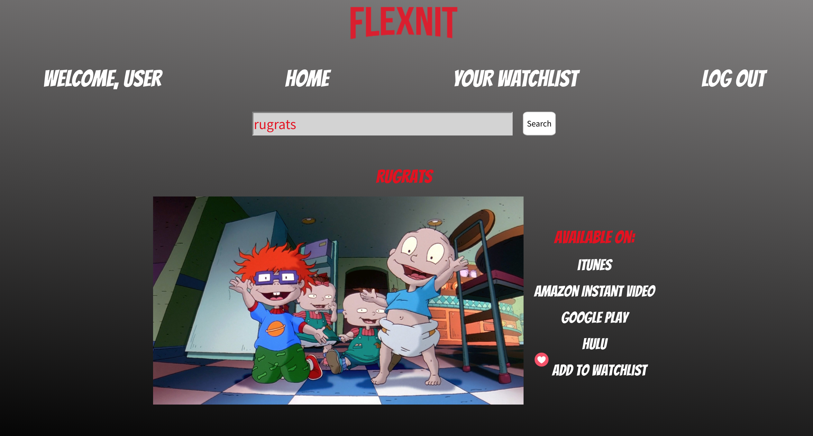

## F L E X N I T

Flexnit is an application for those of use who are tired of browsing for 20 minutes through Netflix and Hulu looking for a show until we realize that the show is on HBO Go and we're not going to pay \$45 to use it once a month. This app uses the Utelly API, which searches for the platform in which a show or movie is provided. The user can sign up, log in, and log out. The user can save and remove movies/shows to their watchlist as well as access their watchlist.

</img>
</img>

## TECHNOLOGIES USED

MongoDB, Express, React.js, Node.js, RapidAPI, and CSS

## CODE

https://capetillo.github.io/flexnit/

## HEROKU DEPLOYED APP

https://flexnit.herokuapp.com/

## NEXT STEPS

Future steps include adding the platforms to your watchlist, implementing The Movie DB API to obtain popular movies and shows and display them in the home page instead of the youtube video, and being able to email the movie or show to a friend through email.js.
